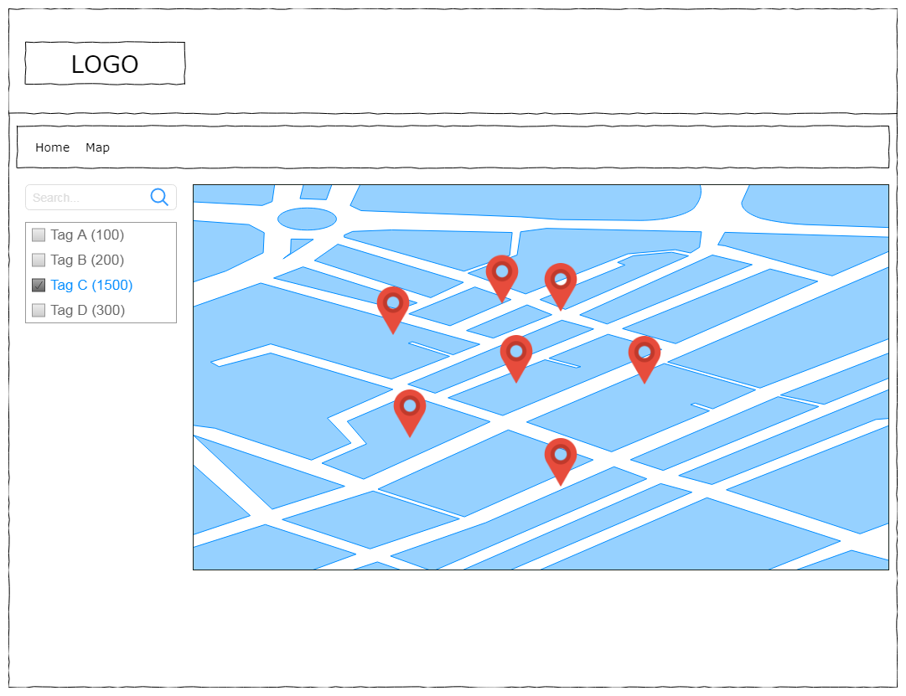
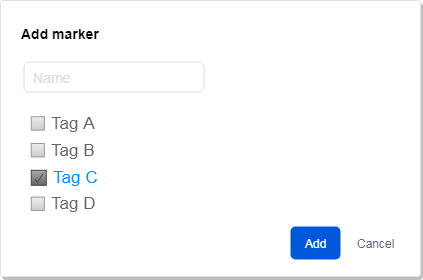

# Task scope
Create WordPress plugin that draws markers on map using [Mapbox GL JS](https://docs.mapbox.com/mapbox-gl-js/api/), allows visitors to search/filter markers by tags and to add their own markers.

## Back-end
1. Admin page with settings, created via [Advanced Custom Fields](https://wordpress.org/plugins/advanced-custom-fields/) (*acf_add_local_field_group*)
2. [WP REST](https://developer.wordpress.org/rest-api/) custom endpoint
3. All data stored in separate MySQL table(s)

## Settings page
1. Text field for map page slug, defaults to `/map/`
2. Select field with dropdown list of all templates from the current WordPress theme
3. Textarea with each tag on new line
4. Text field for [Mapbox token](https://docs.mapbox.com/help/how-mapbox-works/access-tokens/)

## Front-end
1. Front-end part is rendered using [Twig](https://twig.symfony.com/) templates
2. Layout and JS based on Bootstrap
3. UI interactions loaded via AJAX from custom WP REST endpoint (*not wp-ajax!*)
4. CSS/SCSS is up to you, you can use gulp/grunt/webpack to build assets  

# Map page
1. **Base Level** (*required*)
	- Accessible via `/map/` slug by default (slug can be changed in settings). It must be virtual page.
	- Page template also taken from settings
	- Plugin content automatically printed in main content area of the selected template
	- Plugin content blocks:
		- Mapbox with markers
		- Sidebar with filters
	- Filters has predefined list of tags, with checkbox for each tag (multiple tags can be selected)
	- Each tag has corresponding number next to it, with count of markers that will be filtered (in total) if current tag is selected.
	- When some tag is selected/unselected all numbers should be updated with recalculated data
	- Click on map, that opens modal with settings for new marker - name (required), tags (optional). Would be great if you use [select2](https://select2.org/) or [chosen](https://harvesthq.github.io/chosen/) to select tags.
	- Click on marker that shows marker details: name and tags, date added.
	- Highlight another color markers added by the current WP user
2. **Advanced level** (*optional*)
	- Add search field to search by marker name (name field in add modal)
	- Update markers count based on current region visible on map
	- When tag is selected add URL path part (/map/tag-1/tag-2/.../tag-N/) for each selected tag without reloading the page
	- When URL part for the tag is removed (on navigation event), update all filters with the current URL path
	- When page is accessed directly by this URL (/map/tag-1/tag-2/.../tag-N/) it should load all filters automatically
	- Add filter for `My Markers` / `All Markers`
	- Option to edit/delete own markers for each WP user/guest visitor (without authentication form but with authorization)
	- Add admin settings for default map region (center coordinates & zoom), selected via interactive map
3. **Theory** (*no code required, just explanation*)
	- How you'd change/optimize the architecture of this plugin if the number of saved markers is 1M? 100M?

# Workflow
1.  Use any WordPress you want, single or multisite, version 4.9+
2.  Clone this repository
3.  Run `composer install` and `bower install` in plugin folder
4.  Push result to public repository on bitbucket/github and send us link.

# Coding guidelines
1.  PHP (7.0+) code must match [WordPress PHP Coding Standards](https://make.wordpress.org/core/handbook/best-practices/coding-standards/php/)
2.  It must follow patterns from the wireframe plugin - specification for autoloading, namespaces, strict types (if specified), each method must specify arguments and return types (except void) etc
3.  3rd party assets included via Bower, Composer and NPM
4.  JavaScript should be IE10 compatible (which means ES5, or compiled)
5.  Feel free to use all modern CSS features, but better use bootstrap classes.
